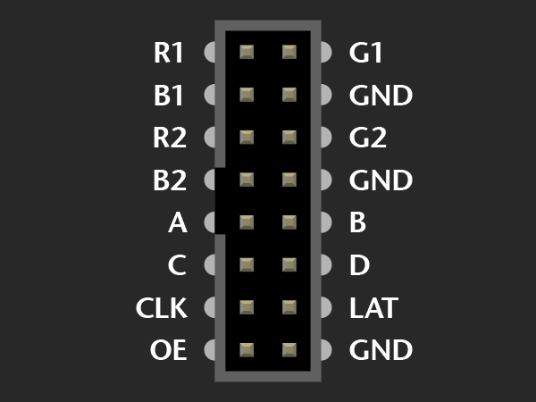

# LED-Matrix-Control

## Reference
[Origianl Github Link](https://github.com/hzeller/rpi-rgb-led-matrix)


## Visual Studio Setting
### Install C++ for Linux


## Raspberry Pi Wiring


```json
R1=14       G1=15
B1=23       GND
R2=24       G2=25
B2=8        GND
A=7         B=16
C=4         D
CLK=22      LAT=9
OE=6
```

## Use

### open LED-Matrix-Control.sln file
### [Raspberry Pi SSH Connection Setting](https://github.com/Hi-Class/Cpp/blob/main/LED-Matrix-Control/readme/readme.md)
### Press F5 to Run